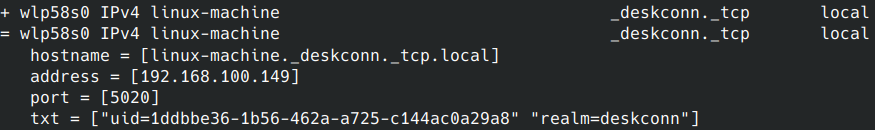

# deskconnd

Secure, cross-platform IPC on the network.

## Getting started

### Clone repo

```shell
git clone https://github.com/deskconn/deskconnd.git
```

then just cd into the directory

```shell
cd deskconnd
```

### Install requirements

```
bash get_requirements.sh
source venv/bin/activate
```

or

```shell
sudo apt update && apt upgrade -y
sudo apt install virtualenv gcc python3-dev -y
virtualenv venv
source venv/bin/activate
pip3 install wheel -r requirements.txt
```

or also with snap

```shell
snap install deskconnd
```

### Initialization

```shell
bash scripts/daemon_dev.sh
```

or just do snap

```shell
snap install deskconnd
```

list of discorable devices by avahi-browse
```shell
avahi-browse ar
```


### Disable Service Discovery

```shell
python3 cli.py discovery disable
```

or call through wamp by authid and private_key

```shell
 wamp --url ws://127.0.0.1:5020/ws --realm deskconn  --authid authid  --authrole deskconn --private-key private_key
  call org.deskconn.disable_discovery
```

or

```shell
desckonnctl discovery disable
```

### Enable Service Discovery

```shell
python3 cli.py discovery enable
```

or enable through wamp by authid and private_key

```shell
 wamp --url ws://127.0.0.1:5020/ws --realm deskconn  --authid authid --authrole deskconn --private-key private_key
call org.deskconn.enable_discovery
```

or

```shell
desckonnctl discovery enable
```

### Start pairing

```shell
python3 cli.py pair
```
or 

```shell
deskconnctl pair
```

